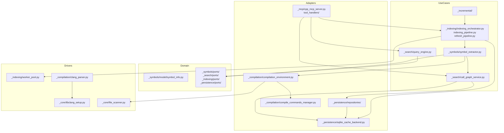
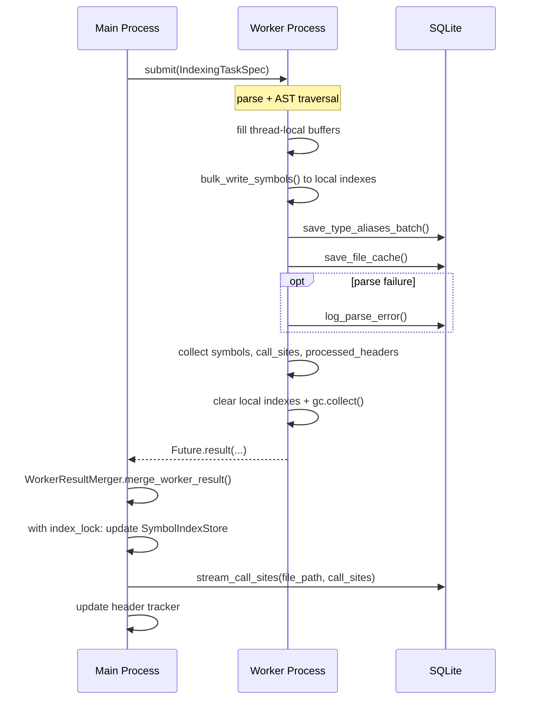
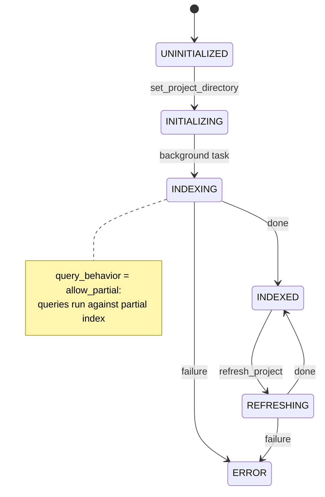

# C++ Analyzer Architecture

An MCP server that indexes C++ projects with libclang and exposes semantic query tools.

## Overview

Core responsibilities:

- **Indexing**: parse C++ files with libclang, extract symbols, call sites, type aliases, and dependencies.
- **Persistence**: store extracted data in SQLite with FTS5 and WAL mode.
- **Querying**: search symbols, class hierarchies, call graphs, and type aliases.
- **Incremental refresh**: detect changed files via content hashes and re-analyze only affected files.

## Clean Architecture Mapping

| Layer | Directory / Key Files | Responsibility |
|---|---|---|
| **Domain** | `_symbols/model/symbol_info.py` | `SymbolInfo` and domain helpers |
| | `_symbols/ports/parser.py` | `SymbolParser` port, `ParseResult`, `CallSiteRecord`, `TypeAliasRecord` |
| | `_search/ports/search_deps.py` | Search-layer dependency protocols |
| | `_indexing/ports/cache_backend.py` | `CacheBackend` port |
| | `_persistence/ports/recovery.py` | `CacheRecoveryPort` |
| **Use Cases** | `_indexing/indexing_orchestrator.py` | Full project indexing orchestration |
| | `_indexing/indexing_pipeline.py` | Single-file indexing pipeline |
| | `_indexing/refresh_pipeline.py` | Incremental refresh |
| | `_symbols/symbol_extractor.py` | Coordinates AST-based symbol extraction |
| | `_search/query_engine.py` | Search and analysis queries |
| | `_search/call_graph_service.py` | Call graph queries |
| | `_incremental/incremental_analyzer.py` | Change detection and cascade re-analysis |
| | `_incremental/change_scanner.py` | MD5-based change scanning |
| **Interface Adapters** | `_mcp/cpp_mcp_server.py`, `_mcp/tool_handlers/*.py` | MCP tools and transport |
| | `_persistence/sqlite_cache_backend.py` | SQLite `CacheBackend` implementation |
| | `_persistence/repositories/*.py` | SQLite repositories |
| | `_compilation/compile_commands_manager.py` | `compile_commands.json` loading and caching |
| | `_compilation/compilation_environment.py` | Compile args and file scanning |
| **Frameworks / Drivers** | `_compilation/clang_parser.py`, `_compilation/clang_symbol_parser.py` | libclang parsing |
| | `_core/libclang_setup.py`, `_core/file_scanner.py` | libclang setup and file discovery |
| | `_indexing/worker_pool.py` | `ProcessPoolExecutor` |
| | `libclang/` | libclang binaries |

### Dependency Rule

Dependencies point inward: frameworks depend on adapters, adapters depend on use cases, use cases depend on domain. Wiring is centralized in `composition_root.py`.

## Functional Domains

```
┌─────────────────────────────────────────┐
│ MCP Tools & Transport                   │
│ _mcp/cpp_mcp_server.py                  │
│ _mcp/tool_handlers/                     │
│ _mcp/transport/                         │
├─────────────────────────────────────────┤
│ Query & Analysis                        │
│ _search/query_engine.py                 │
│ _search/search_engine.py                │
│ _search/call_graph_service.py           │
│ _search/hierarchy_analyzer.py           │
├─────────────────────────────────────────┤
│ Symbol Extraction                       │
│ _symbols/symbol_extractor.py            │
│ _symbols/model/                         │
│ _compilation/clang_symbol_parser.py     │
├─────────────────────────────────────────┤
│ Indexing Orchestration                  │
│ _indexing/indexing_orchestrator.py      │
│ _indexing/indexing_pipeline.py          │
│ _indexing/refresh_pipeline.py           │
│ _incremental/                           │
├─────────────────────────────────────────┤
│ Persistence & Project Identity          │
│ _persistence/sqlite_cache_backend.py    │
│ _persistence/repositories/              │
│ _persistence/cache_manager.py           │
│ _persistence/project_identity.py        │
├─────────────────────────────────────────┤
│ Compilation Environment                 │
│ _compilation/compile_commands_manager.py│
│ _compilation/compilation_environment.py │
│ _compilation/clang_parser.py            │
├─────────────────────────────────────────┤
│ Shared Infrastructure                   │
│ _core/file_scanner.py                   │
│ _core/libclang_setup.py                 │
│ _core/concurrency_context.py            │
│ _core/cancellation_coordinator.py       │
└─────────────────────────────────────────┘
```

## Module Dependency Graph



## Execution Model

The server runs one main process and spawns worker processes for indexing.

```
┌─────────────────────────────────────────────────────────────┐
│ Main Process                                                │
│  • MCP server                                               │
│  • CppAnalyzer facade                                       │
│  • CompositionRoot / ProjectContext                         │
│  • SymbolIndexStore (in-memory indexes)                     │
│  • SQLite cache manager                                     │
└───────────────────────┬─────────────────────────────────────┘
                        │ spawn
        ┌───────────────┼───────────────┐
        ▼               ▼               ▼
┌──────────────┐ ┌──────────────┐ ┌──────────────┐
│ Worker 1     │ │ Worker 2     │ │ Worker N     │
│  • own Index │ │  • own Index │ │  • own Index │
│  • own TU    │ │  • own TU    │ │  • own TU    │
│  • parses    │ │  • parses    │ │  • parses    │
│    one file  │ │    one file  │ │    one file  │
└──────────────┘ └──────────────┘ └──────────────┘
        │               │               │
        └───────────────┼───────────────┘
                        ▼
        Results merged into main process indexes and SQLite
```

- Workers use `spawn` multiprocessing for fork safety.
- Each worker lazily creates a single `CppAnalyzer` instance per process.
- Workers do not share memory with the main process or each other.
- SQLite with WAL mode is the shared persistent store.

## Concurrency & IPC

### Worker-to-Main Data Flow



### What Workers Write Directly vs Return

| Data | Worker Action | Main Process Action | Storage |
|---|---|---|---|
| Symbols | Extract and return via `Future` | Merge into in-memory `SymbolIndexStore` | In-memory + file cache in SQLite |
| Call sites | Extract and return via `Future` | Atomically replace per-file entries in SQLite | SQLite |
| Type aliases | Write batch directly to SQLite | — | SQLite |
| File cache | Write directly to SQLite | — | SQLite |
| Parse errors | Append directly to JSONL | Read on demand | JSONL file |
| Processed headers | Return via `Future` | Update `HeaderProcessingTracker` | In-memory + `header_tracker.json` |

Call sites go through the main process because they require atomic per-file replacement (`DELETE` old + `INSERT` new). Type aliases and file cache are simple batch writes, so workers write them directly to reduce IPC.

### Lock Minimization

- Workers parse and extract independently. They never hold the main process `index_lock`.
- `SymbolExtractor` uses thread-local buffers during AST traversal and acquires a lock only once for `bulk_write_symbols()`.
- The main process `index_lock` is held only for the brief merge of one file's results.
- SQLite WAL mode separates readers from writers; a busy handler resolves short conflicts.

### Synchronization Primitives

| Primitive | Type | Protects | Location |
|---|---|---|---|
| `ConcurrencyContext.index_lock` | `threading.RLock` | Main process `SymbolIndexStore` | `_core/concurrency_context.py` |
| Worker-local lock | `threading.RLock` | Worker-local `SymbolIndexStore` | per-worker `ConcurrencyContext` |
| `AnalyzerStateManager._lock` | `threading.Lock` | State + active tool counter | `_mcp/state_manager.py` |
| `_tools_event` | `threading.Event` | Tool-call priority over indexing | `_mcp/state_manager.py` |
| `_indexed_event` | `threading.Event` | Completion signal for indexing | `_mcp/state_manager.py` |
| SQLite WAL + busy handler | SQLite | Persistent cache | `_persistence/sqlite_cache_backend.py` |
| Header tracker lock | `threading.Lock` | `HeaderProcessingTracker` state | `_persistence/header_tracker.py` |

### Indexing vs Query Synchronization

The analyzer lifecycle is managed by `AnalyzerStateManager`:



- Query tools are rejected when the analyzer is `UNINITIALIZED`, `INITIALIZING`, or `ERROR`.
- Query behavior is controlled by `query_behavior` config: `allow_partial`, `block`, or `reject`.
- Tool handlers wrap execution in `state_manager.tool_execution()`, incrementing an active-tool counter.
- Indexing callbacks call `wait_for_tools_to_finish()` between files, giving active tool calls priority.

## File-to-Function Cheat Sheet

| Task | Files |
|---|---|
| Add or change an MCP tool | `_mcp/tool_handlers/*.py`, `_mcp/tool_registry.py`, `_mcp/consolidated_tools.py` |
| Change symbol extraction | `_symbols/symbol_extractor.py`, `_compilation/clang_symbol_parser.py` |
| Change result model | `_symbols/model/symbol_info.py` |
| Change search behavior | `_search/query_engine.py`, `_search/search_engine.py` |
| Change call graph behavior | `_search/call_graph_service.py`, `_search/call_graph.py` |
| Change SQLite schema | `clang_index_mcp/schema.sql`, `_persistence/sqlite_cache_backend.py` (`CURRENT_SCHEMA_VERSION`) |
| Change incremental refresh | `_incremental/incremental_analyzer.py`, `_incremental/change_scanner.py`, `_search/dependency_graph.py` |
| Change header deduplication | `_persistence/header_tracker.py` |
| Change parallel execution | `_indexing/worker_pool.py`, `_indexing/indexing_task_submitter.py`, `_indexing/worker_result_merger.py` |
| Change compilation args / compile_commands | `_compilation/compile_commands_manager.py`, `_compilation/compilation_environment.py` |
| Wire dependencies | `composition_root.py` |
| Thin public API | `cpp_analyzer.py` |
